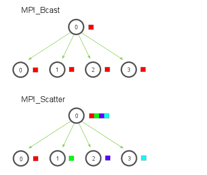

[Explanation](https://medium.com/fintechexplained/advanced-python-concurrency-and-parallelism-82e378f26ced)


# Paralellsim & concurrency

## multiprocessing cube
Simple multiprocessing example


## pipe communication
If two processes need to communicate, Pipe’s the best choice. A pipe can have two end-points where each has `send() 
and `recv()` methods. Data in a pipe could get corrupted if two processes (threads) read from or write to the same 
end-point simultaneously. That's why queue is one of the solutions.

## queue
To store the output of multiple processes in a shared communication channel, a queue can be used. 
For instance, assume that the task is to find the cubes of the first ten natural numbers followed by adding 1 to each number.

Define two functions sum() and cube(). Then define a Queue (q) and call cube() function followed by the add() function


## How to Implement Shared Memory
Taking a cue from Queue, Shared Memory stores the shared data among the processes seamlessly. It can be of two types: Value or Array.


### Value
The number 4 is passed as an argument to the function cube(). value attribute fetches the actual value of the Value, num. The modified number is later sent to the cube() function. The final double-cubed number is then reflected in the print statement.

### Array
A list of values can be shared amongst multiple processes. 
Array() initializes an empty array possessing int data type having a length 3. 
The array has been looped over by adding 1 to every element in it.

You can use arr in a different process, just as Value. This essentially is the concept of shared memory.

Note: `‘d’` indicates double-precision float, and `‘i’` (in Array(“i”, 3)) indicates a signed integer.


## How to Implement Server Process

A server process is the main process that gets triggered on the commencement of a Python program. Other processes could utilize its objects for manipulation. A manager object of the class Manager() controls a server process. Manager() supports multiple data types such as list, dict, Lock, RLock, Semaphore, BoundedSemaphore, Namespace, Condition, Event, Queue, Value, and Array.


```
python3 server-process.py
```

Shared Memory vs. Server Process:

    * Manager() supports a variety of data types in comparison with shared memory
    * Processes can share a single manager on different computers over a network
    * A server process is slower than shared memory


## Using Pool

The Pool class in multiprocessing can handle an enormous number of processes. It allows you to run multiple jobs per process (due to its ability to queue the jobs). The memory is allocated only to the executing processes, unlike the Process class, which allocates memory to all the processes. The Pool class takes the number of worker processes to be present in the pool and spawns the processes

Launching many processes using the Process class is practically infeasible as it could break the OS. Hence comes Pool which shall handle the distribution of jobs to and collection of results from all the spawned processes in the presence of a minimal number of worker processes (most preferably, the number of worker processes is equal to CPU cores).


Pool class comes with six valuable methods:

* apply() method blocks the primary process until all the processes are complete.
It accepts multiple arguments, maintains the order of the result, and isn’t concurrent


* apply_async() - A callback function in apply_async() can be used to return the value immediately 
after its execution is complete. This method maintains the order of the result and supports concurrency.
You can use wait() to block the asynchronous calls


* map_async() - Unlike map(), map_async() is non-blocking (and maintains the order of the result).


* imap() - Unlike map(), imap() doesn’t wait for all the results and returns an iterator (not a list).


# Distributed computing & parallelsim
## MPI

MPI is a standardized and portable message-passing system designed
to function on a wide variety of parallel computers.
MPI is to be used in computers with distributed memory. 
If you’re using a shared memory multiprocessor architecture, I would recommend using multithreading, 
to avoid the communication overhead from message passing.


The multiprocessing module is a great option to use for parallelization on personal computers. 
It has limitations,so if you eventually want to scale up to a super compute you should use a parallelization model compatible with Message Passing Interface (MPI).


Running a Python script with MPI is a little different than you’re likely used to.
With `mpiexec` and `mpirun` each line of code will be run by each processor, unless specified otherwise. 
Let’s make a ‘hello world’ example to demonstrate the MPI basics.

Command:
```
mpiexec -n 4 python main.py
```


https://mpi4py.readthedocs.io/en/stable/tutorial.html


## Colective communication

### Broadcasting
Broadcasting takes a variable and sends an exact copy of it to all processes on a communicator.

### Scattering
Scatter takes an array and distributes contiguous sections of it across the ranks of a communicator.

*Restrictions to scatter: you can only scatter as many elements as you have processors!*

Scatter is not as convenient in practice since it requires the size of the large array to be divisible by the number of processes. 
For instance, if we know beforehand that the array we are going to distribute has 16 elements, it will be straightforward to use Scatter to distribute the array on 4 processes in such a way that each process gets 4 elements. 
The problem is that, in practice, the size of the array is not known beforehand and is therefore not guaranteed to be divisible
by the number of available processes. It is more practical to use Scatterv, the vector version of Scatter, 
which offers a much more flexible way to distribute the array. The code below distributes 15 numbers over 4 processes. 


